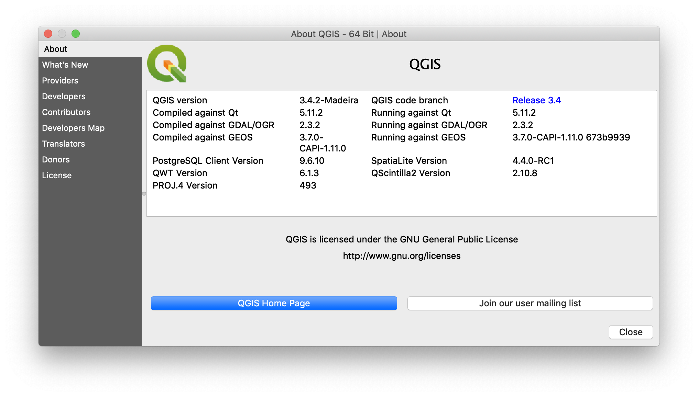
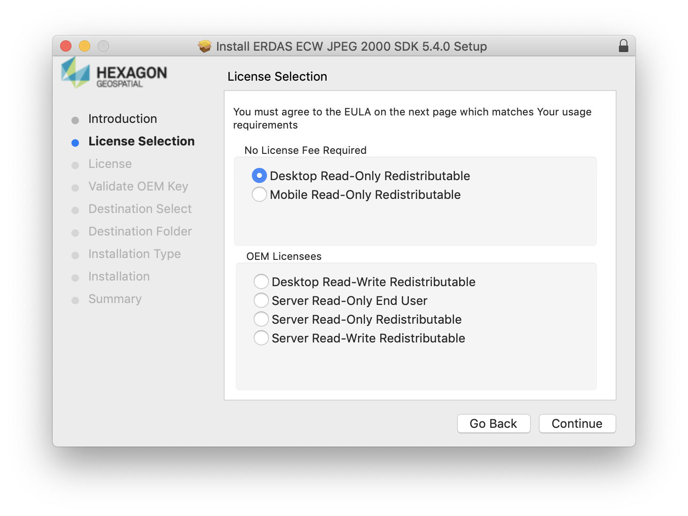
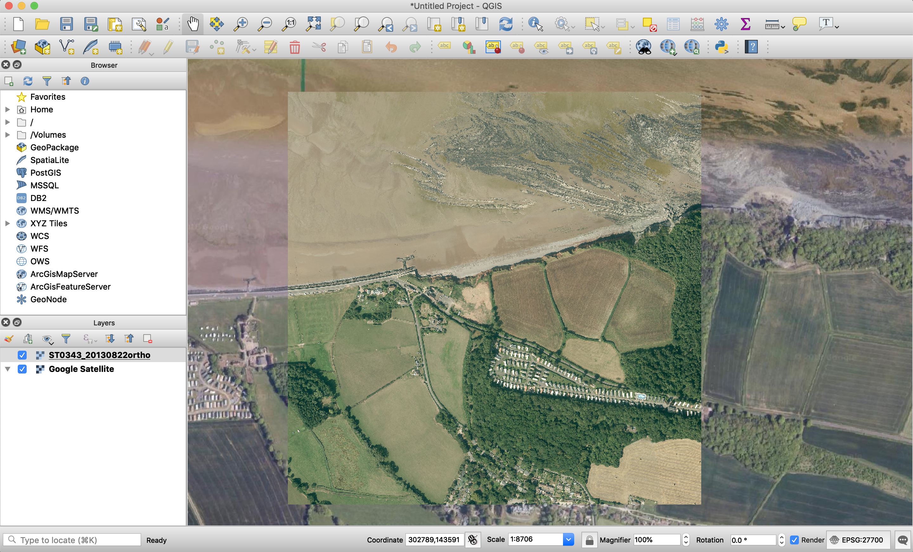

# How to add .ecw reading capability to QGIS3 on MacOS

Hopefully this provides a easy to read guide on how to add .ecw reading capability to QGIS3 on MacOS. 

There're 5 sections:
1. Determine your GDAL Version
2. Download the required plugin and SDK
3. Install the ERDAS ECW/JPEG2000 SDK
4. Copy over the required files to GDAL
5. Install the ECW Plugin

## Assumptions:
* You can use Homebrew - If not install it from [here](https://brew.sh)
* You have MacOS
* You have installed QGIS3 and it's depencies via Homebrew, if not run:

    ```
    brew tap osgeo/osgeo4mac
    brew install qgis3
    ```
 --- 
## 1. Determine you GDAL Version

The ECW plugin you'll install will depend on the version of GDAL that your QGIS3 was built and is running against.

* You can find out what version you're using by loading up QGIS3 and going to the menu options:

    ```
    QGIS 3 -> About QGIS 3
    ```
* You'll be greeted by something like this:

* You'll notice that I'm going to target GDAL 2.3.2 (Really 2.3)
---
## 2. Download the required plugin and SDK

To add .ecw support you'll need the ECW plugin and the ERDAS ECW/JPEG2000 SDK for your version of GDAL.

The download links can be found [here](http://www.kyngchaos.com/software/frameworks/)

You will find a variety of versions but I'll concentrate on 2.3 (They should all be pretty similar)

**For GDAL 2.3:**

* ECW Plugin v2.3.2-1 [Download Here](http://www.kyngchaos.com/files/software/frameworks/GDAL-ECW_Plugin-2.3.2-1.dmg)
* ERDAS ECW/JPEG2000 SDK 5.4 [Download Here](https://download.hexagongeospatial.com/downloads/ecw/erdas-ecw-jp2-sdk-v5-4-macosx) (You'll need to give some contact details to get the download button)
---
## 3. Install the ERDAS ECW/JPEG2000 SDK

* Open the SDK .dmg and open the .pkg file - I find right clicking and opening prevents any security warnings
* Follow the on-screen installation instructions, making sure you select **Desktop Read-Only Redistributable** on the License Selection page

* You shouldn't need to do anything else other than click through the install
---
## 4. Copy over the required files to GDAL

* Open your terminal of choice and run:
    * `cd /Hexagon/ERDASEcwJpeg2000SDK5.4.0/Desktop_Read-Only/lib/libc++/dynamic`
    * `sudo mkdir /Library/Application\ Support/GDAL/2.3/Libraries`
    * `sudo cp libNCSEcw.dylib /Library/Application\ Support/GDAL/2.3/Libraries/`
    * `sudo cp -R ../../../etc /Library/Application\ Support/GDAL/2.3/`
    * `tree /Library/Application\ Support/GDAL/2.3/` you should get a structure similar to:
        ```
        /Library/Application\ Support/GDAL/2.3/
        ├── Libraries
        │   └── libNCSEcw.dylib
        └── etc
        ```
* If you want to clear up space, you can now run:
`sudo rm -rf /Hexagon/`
---
## 5. Install the ECW Plugin

* Open the ECW Plugin .dmg, if you've succesfully put the SDK you should get no warning messages or errors
* Follow the installation instructions without changing any of the defaults
* Once installed, run `tree /Library/Application\ Support/GDAL/2.3/` and you should get a structure with the plugin now:
    ```
    /Library/Application\ Support/GDAL/2.3/
    ├── Libraries
    │   └── libNCSEcw.dylib
    ├── PlugIns
    │   └── gdal_ECW_JP2ECW.dylib
    └── etc
    ```
---
## 5.1 Fingers crossed...
Hopefully, having gotten up to this point you've not had any errors. I restarted my Mac, but it may not be necessary (I would anyway).

Open up QGIS3 and with any luck when you go to `Layer -> Add Layer -> Add Raster Layer...` and navigate to your .ecw file, it should load without issue!



This took me a few days to try and find a working solution that also used Homebrew for the most part. Please do give me a shout if this doesn't work for you or you have a better way to go about this.

It's easiest to tweet me @Ciaran_Evans

:) 

